# Source-of-Truth Map (Calculation Logic)

This document is the authoritative visual reference for **who owns what
arithmetic in tapix**. It is the close-out artefact of the 10-phase
scattered-calculation-logic migration (see
[`adr/0001-pricing-engines-as-sot.md`](adr/0001-pricing-engines-as-sot.md)).

If a file performs business arithmetic on money, qty, tax, discount,
balance, cost, commission, loyalty, payroll, or stock, it MUST appear
in one of two roles below:

- **SoT (engine / service / value object)** — owns the formula and, when
  applicable, the database mutation.
- **Consumer** — calls the SoT. Never re-implements the formula.

Read-only display formatting (`CurrencyService.format`, PDF row builders,
sort comparators) is out of scope: it does not compute a domain value.

---

## 1. Architectural overview

```mermaid
flowchart TB

  classDef sot fill:#dff5dd,stroke:#2e7d32,color:#1b5e20,stroke-width:2px;
  classDef helper fill:#e3f2fd,stroke:#1565c0,color:#0d47a1;
  classDef consumer fill:#fff3e0,stroke:#ef6c00,color:#e65100;
  classDef store fill:#f3e5f5,stroke:#6a1b9a,color:#4a148c,stroke-dasharray: 4 2;

  subgraph PRIMITIVES["Layer 0 — Primitive math kernels (pure, no I/O)"]
    Money["Money<br/>(cents · allocate · percentage · round)"]:::sot
    MoneyParser["MoneyInputParser<br/>(text → cents, sign-aware)"]:::sot
    DiscountVO["Discount<br/>(none · fixed · percent)"]:::sot
    DiscountConv["DiscountConverter<br/>(% ↔ ¢)"]:::sot
    RatioH["RatioHelper<br/>(percent · bpsToPercent)"]:::helper
    LedgerRB["LedgerRunningBalance<br/>(integer accumulator)"]:::helper
  end

  subgraph ENGINES["Layer 1 — Pricing & tax engines (pure)"]
    LinePE["LineItemPricingEngine"]:::sot
    InvPE["InvoicePricingEngine<br/>(largest-remainder proration)"]:::sot
    TaxCS["TaxCalculationService<br/>(+ recoverRateBps)"]:::sot
    RetCS["ReturnCalculationService<br/>(computeProportionalReturn · aggregate)"]:::sot
  end

  subgraph DOMAIN["Layer 2 — Domain services (stateful, sole writers)"]
    BalSvc["BalanceService<br/>(customers · suppliers)"]:::sot
    StockSvc["StockService"]:::sot
    BatchSvc["BatchService<br/>(FIFO lifecycle)"]:::sot
    CostSvc["ProductCostService<br/>(WAC)"]:::sot
    InvVal["InventoryValuationService"]:::sot
    InvAdj["InventoryAdjustmentService"]:::sot
    OrigPR["OriginalPriceResolver"]:::sot
    JES["JournalEntryService"]:::sot
    AcctRepo["AccountingRepository<br/>(_updateAccountBalance · getTrialBalance · createJournalEntry)"]:::sot
    RetPost["ReturnPostingService<br/>+ ReturnJournalPolicy"]:::sot
    UnifRet["UnifiedReturnService"]:::sot
    CCNote["CustomerCreditNoteService"]:::sot
    PartyClass["PartyBalanceClassifier"]:::sot
    LedgerReb["LedgerRebuildService"]:::sot
    DataInt["DataIntegrityService"]:::sot
    Payroll["PayrollCalculationService"]:::sot
    BelowCost["BelowCostSaleService"]:::sot
    CommSvc["CommissionService<br/>(largest-remainder reversal)"]:::sot
    LoySvc["LoyaltyPointsService<br/>(award · reverse · preview)"]:::sot
  end

  subgraph DAOS["Layer 3 — DAO orchestrators (compose SoTs in one tx)"]
    SaleDao["SaleDao"]:::sot
    PurchDao["PurchaseDao"]:::sot
    AdjRetDao["AdjustmentReturnDao"]:::sot
  end

  subgraph CONSUMERS["Layer 4 — Consumers (must call, never re-implement)"]
    BlocsForm["Form blocs<br/>(sale · purchase · returns · adj-returns)"]:::consumer
    BlocsRep["Report blocs<br/>(profit · discount · ledger · statement · aging · commission)"]:::consumer
    Screens["Screens / dialogs / sheets"]:::consumer
    Repos["Repositories<br/>(sale · purchase · customer · supplier · loyalty)"]:::consumer
    PDF["PDF / Excel exporters"]:::consumer
    Entities["Domain entities<br/>(data carriers only)"]:::consumer
  end

  subgraph STORES["Persisted columns (single-writer enforced)"]
    direction LR
    AcctsBal[("accounts.balance_cents")]:::store
    CustBal[("customers.balance_cents")]:::store
    SuppBal[("suppliers.balance_cents")]:::store
    Stock[("products / product_variants .stock_quantity")]:::store
    Cost[("products / product_variants .cost_cents")]:::store
    Batch[("product_batches.remaining_quantity")]:::store
    Comm[("commissions")]:::store
    Loy[("loyalty_point_transactions<br/>customers.loyalty_points_balance")]:::store
    CCNoteCol[("customer_credit_notes.balance_cents")]:::store
    InvTot[("sales / purchases .{subtotal,discount,tax,total}_cents")]:::store
  end

  %% Primitive composition
  Money --> LinePE
  Money --> InvPE
  Money --> CommSvc
  Money --> RetCS
  MoneyParser --> BlocsForm
  DiscountVO --> LinePE
  DiscountVO --> InvPE
  DiscountConv --> Screens
  RatioH --> BlocsRep
  LedgerRB --> BlocsRep

  %% Engines compose primitives
  LinePE --> InvPE
  TaxCS --> LinePE
  TaxCS --> InvPE
  TaxCS --> AdjRetDao
  RetCS --> UnifRet

  %% Domain services own writes
  BalSvc --> CustBal
  BalSvc --> SuppBal
  StockSvc --> Stock
  BatchSvc --> Batch
  CostSvc --> Cost
  InvAdj --> JES
  JES --> AcctRepo
  AcctRepo --> AcctsBal
  CommSvc --> Comm
  LoySvc --> Loy
  CCNote --> CCNoteCol

  %% DAOs orchestrate
  InvPE --> SaleDao
  InvPE --> PurchDao
  StockSvc --> SaleDao
  StockSvc --> PurchDao
  StockSvc --> AdjRetDao
  BalSvc --> SaleDao
  BalSvc --> PurchDao
  BalSvc --> AdjRetDao
  CostSvc --> PurchDao
  BatchSvc --> PurchDao
  BatchSvc --> SaleDao
  JES --> SaleDao
  JES --> PurchDao
  JES --> AdjRetDao
  SaleDao --> InvTot
  PurchDao --> InvTot

  %% Consumers
  BlocsForm --> InvPE
  BlocsForm --> LinePE
  BlocsForm --> RetCS
  BlocsForm --> DiscountVO
  BlocsForm --> MoneyParser
  BlocsRep --> RatioH
  BlocsRep --> LedgerRB
  BlocsRep --> AcctRepo
  Repos --> SaleDao
  Repos --> PurchDao
  Repos --> CommSvc
  Repos --> LoySvc
  Repos --> BalSvc
  Repos --> CCNote
  Screens --> BlocsForm
  PDF --> Entities
```

---

## 2. Layer 0 — Primitive kernels

| File | Owns |
|------|------|
| [`lib/core/money/money.dart`](../lib/core/money/money.dart) | Cents arithmetic · `percentage(bps)` · `allocate(weights)` (largest-remainder) · 3 rounding modes |
| [`lib/core/money/money_input_parser.dart`](../lib/core/money/money_input_parser.dart) | Text → cents, currency-aware (3/2/0 digit currencies), Arabic-Indic / Persian / Urdu digit normalisation, sign-aware via `parseSignedOrZero` |
| [`lib/core/pricing/discount.dart`](../lib/core/pricing/discount.dart) | `Discount.none / fixed / percent(bps)` + `resolve(base, mode)` |
| [`lib/core/services/pricing/discount_converter.dart`](../lib/core/services/pricing/discount_converter.dart) | UI fixed ↔ percent (Decimal-internal) |
| [`lib/core/services/reporting/ratio_helper.dart`](../lib/core/services/reporting/ratio_helper.dart) | `percent(num, den) → double` · `bpsToPercent(bps) → double` |
| [`lib/core/services/ledger/ledger_running_balance.dart`](../lib/core/services/ledger/ledger_running_balance.dart) | Integer running-balance accumulator |

## 3. Layer 1 — Pricing & tax engines

| File | Owns |
|------|------|
| [`lib/core/pricing/line_item_pricing_engine.dart`](../lib/core/pricing/line_item_pricing_engine.dart) | Per-line `subtotal → discount → net → tax → total` |
| [`lib/core/pricing/invoice_pricing_engine.dart`](../lib/core/pricing/invoice_pricing_engine.dart) | Invoice composition · overall-discount proration on `Σ line.net` · tax on adjusted net |
| [`lib/core/services/tax_calculation_service.dart`](../lib/core/services/tax_calculation_service.dart) | `calculateTax` · `calculateLineItemTax` · `calculateInvoiceTax` · `distributeProportionally` · `recoverRateBps` (inverse) · negative-symmetry · audit trail |
| [`lib/core/services/return_calculation_service.dart`](../lib/core/services/return_calculation_service.dart) | `computeProportionalReturn` (per line) · `aggregate` (rollup) |

## 4. Layer 2 — Domain services (sole writers of their columns)

| Service | Column / domain it owns |
|---------|------------------------|
| `BalanceService` | `customers.balance_cents` · `suppliers.balance_cents` |
| `StockService` | `products.stock_quantity` · `product_variants.stock_quantity` |
| `BatchService` | `product_batches.remaining_quantity` + FIFO lifecycle |
| `ProductCostService` | `products.cost_cents` · `product_variants.cost_cents` (WAC) |
| `InventoryValuationService` | Global FIFO/WAC method selection |
| `InventoryAdjustmentService` | Shrinkage / gain / revaluation / opening-balance |
| `OriginalPriceResolver` | Original cost / price / wholesale snapshot resolution |
| `JournalEntryService` | Every chart-of-accounts mutation event |
| `AccountingRepository` | `accounts.balance_cents` (sole writer) · `getTrialBalance` · double-entry validation |
| `ReturnPostingService` + `ReturnJournalPolicy` | Posted journal lines for sale/purchase returns (linked + adjustment) |
| `UnifiedReturnService` | Cross-invoice return line allocation |
| `CustomerCreditNoteService` | `customer_credit_notes.balance_cents` + credit-note JEs |
| `PartyBalanceClassifier` | Balance-sign classification for customers/suppliers |
| `LedgerRebuildService` | Full ledger replay (gated by confirmation token) |
| `DataIntegrityService` | Balanced-journal · trial-balance · negative-stock invariants |
| `PayrollCalculationService` | Daily rate · deductions · overtime · gross/net · sales-target bonus |
| `BelowCostSaleService` | Loss = cost − sellingPrice, lossPercent |
| `CommissionService` (Phase 6) | `commissions` rows (create · reverse via `Money.allocate` · delete) |
| `LoyaltyPointsService` (Phase 6) | `loyalty_point_transactions` + `customers.loyalty_points_balance` (award · reverse · preview) |

## 5. Layer 3 — DAO orchestrators (compose SoTs inside one tx)

These DAOs may invoke the services above; they are not allowed to invent
calculation logic.

| File | Lifecycle owned |
|------|----------------|
| [`lib/core/database/daos/sale_dao.dart`](../lib/core/database/daos/sale_dao.dart) | `postSale` · `voidSale` · sale return post/void · `computeSaleCostCents` · header total recompute |
| [`lib/core/database/daos/purchase_dao.dart`](../lib/core/database/daos/purchase_dao.dart) | `postPurchase` · `voidPurchase` · purchase return post/void · header total recompute |
| [`lib/core/database/daos/adjustment_return_dao.dart`](../lib/core/database/daos/adjustment_return_dao.dart) | Post/void of unlinked sale/purchase adjustment returns + tax-rate snapshot via `TaxCalculationService.recoverRateBps` |

## 6. Layer 4 — Consumers (must read, never re-implement)

All form blocs, all screens / dialogs / sheets, all repositories (other
than sole-writer ones above), all report blocs, all PDF/Excel
exporters, and all domain entities. Every Phase 1–8 migration funnelled
duplicated formulas into one of the layers above; the
`test/architecture/scattered_patterns_guard_test.dart` test ensures
they stay there.

---

## 7. Enforcement

| Guard | What it bans | Tier |
|-------|--------------|------|
| G2 | `runningBalance += ...` outside `LedgerRunningBalance` | Zero tolerance |
| G3 | Direct calls to `updateCustomerBalance` / `updateSupplierBalance` outside the deprecation chain | Zero tolerance |
| G4 | Inline `creditCents - debitCents` (and inverse) signing outside `TrialBalance` | Zero tolerance |
| G5a | `(double.parse * 100)` text→cents outside `MoneyInputParser` | Ratchet (allow-list shrinks only) |
| G6 | `double * 100` arithmetic inside the `decimalStringToCents` compat shim | Zero tolerance |
| G7 | Inline `/ 10000` bps arithmetic outside pricing / commission / tax SoTs | Allow-listed |
| Schema | Raw `UPDATE accounts SET balance_cents` anywhere under `lib/` | Zero tolerance (separate test) |

All seven guards live in
[`test/architecture/scattered_patterns_guard_test.dart`](../test/architecture/scattered_patterns_guard_test.dart)
and [`test/core/database/app_database_single_writer_guard_test.dart`](../test/core/database/app_database_single_writer_guard_test.dart).

---

## 8. Phase 11 additions — Compliance hardening

Phase 11 added **four** new SoTs on top of the Phase 0–9 layer cake.
They sit at the boundary between Layer 2 (domain services) and the
persisted-columns store. See
[`adr/0001-pricing-engines-as-sot.md §8`](adr/0001-pricing-engines-as-sot.md)
for the full rationale.

| New SoT | Owns | File |
|---------|------|------|
| `FiscalPeriodService.assertOpen` (now wired into the generic JE pipeline) | The "no JE may be posted into a closed fiscal period" invariant — runs inside `AccountingRepository.createJournalEntry` **before** the transaction opens | [`lib/core/services/compliance/fiscal_period_service.dart`](../lib/core/services/compliance/fiscal_period_service.dart) |
| `PricingSnapshot` + `withPricingSnapshot(taxInclusive:)` | The single helper that stamps `pricing_engine_version` / `tax_inclusive_at_post` / `rounding_mode_at_post` onto the 6 header companion types (sale / purchase / sale-return / purchase-return / sale-adj-return / purchase-adj-return) | [`lib/core/pricing/pricing_snapshot.dart`](../lib/core/pricing/pricing_snapshot.dart) |
| Single-currency invariant on JE lines | Rejects mixed-currency journal entries before the transaction opens — math may balance but absent FX accounts the GL would be meaningless | [`lib/features/accounting/data/repositories/accounting_repository.dart`](../lib/features/accounting/data/repositories/accounting_repository.dart) (inside `createJournalEntry`) |
| Granular accounting permissions | `voidJournalEntry` / `closeFiscalPeriod` / `reopenFiscalPeriod` — separate from `voidTransactions` (invoice voids) and `manageAccounting` (GL access); owner-only by default | [`lib/features/auth/domain/entities/permission_constants.dart`](../lib/features/auth/domain/entities/permission_constants.dart) + [`lib/features/auth/data/services/permission_service.dart`](../lib/features/auth/data/services/permission_service.dart) |

### Persisted snapshot columns (new in migration 10054)

Three nullable columns added to **6 header tables** — `sales`,
`purchases`, `sale_returns`, `purchase_returns`,
`sale_return_adjustments`, `purchase_return_adjustments`:

| Column | Type | Source |
|--------|------|--------|
| `pricing_engine_version` | `TEXT` | `PricingEngineVersion.current` (currently `'v1'`) |
| `tax_inclusive_at_post`  | `INTEGER` (0/1) | Engine setting active at post |
| `rounding_mode_at_post`  | `TEXT` | `PricingSnapshot.roundingMode` (currently `'banker'`) |

NULL is a valid legacy value (every pre-Phase-11.2 row reads `NULL`);
new rows are always stamped via the helper extension. The two
canonical constants are pinned by `phase11_2_pricing_snapshot_stamping_test.dart`
so a silent bump fails CI.

---

## 9. Phase 12 additions — Void integrity SoTs (2026-05-13)

Phase 12 added **one new SoT service** plus tightened **two existing
SoTs** that were silently leaking data when a sale or purchase was
voided. Triggered by the field-backup
`tapix_backup_20260513_121448.db` which showed exactly `22997` AR
drift and `−14850` inventory drift on the reconciliation screen. See
[`adr/0001-pricing-engines-as-sot.md §9`](adr/0001-pricing-engines-as-sot.md)
for the full rationale.

| SoT | Owns | File |
|-----|------|------|
| `VoidImpactAnalyzer` (new) | The single read-only computation of "what breaks if we void this document?" — entangled adjustment returns + projected negative stock + signed AR/AP/Inventory deltas | [`lib/core/services/void_impact_analyzer.dart`](../lib/core/services/void_impact_analyzer.dart) |
| `AdjustmentReturnDao` cap queries (tightened) | Now filter by `sales.status = 'completed'` and `purchases.status = 'posted'` so voided / draft documents do not inflate the per-product per-party return cap | [`lib/core/database/daos/adjustment_return_dao.dart`](../lib/core/database/daos/adjustment_return_dao.dart) — methods `getCustomerProductPurchasedQty`, `getCustomerProductReturnedQty`, `getSupplierProductSuppliedQty`, `getSupplierProductReturnedQty` |
| `SaleDao.voidSale` / `PurchaseDao.voidPurchase` (tightened) | Now accept an optional `JournalEntryService` so the cascade reverses each linked-return JE in the same transaction it flips the row to `'voided'`. Without this the GL leg stayed posted while the row was voided. | [`lib/core/database/daos/sale_dao.dart`](../lib/core/database/daos/sale_dao.dart) and [`purchase_dao.dart`](../lib/core/database/daos/purchase_dao.dart) |
| `VoidBlockedByImpactException` | Carries the analyzer report up to the UI; thrown by the repository pre-flight so a corrupting void can never be confirmed silently | [`lib/core/services/void_impact_analyzer.dart`](../lib/core/services/void_impact_analyzer.dart) |
| `VoidImpactDialog` (UX SoT) | Single dialog widget, used by both detail screens, renders blockers (red), warnings (amber), and estimated GL impact (neutral). Confirm button is disabled while any blocker exists. | [`lib/core/widgets/void_impact_dialog.dart`](../lib/core/widgets/void_impact_dialog.dart) |

### Schema change

**None.** The atomic counters `qty_returned_linked` and
`qty_returned_adjustment` on `sale_items` / `purchase_items` were
already the SoT for "what came back". Phase 12 just teaches the cap
and the void path to read them honestly.

### Banned patterns (additions for Phase 12)

| Pattern | File-level rule |
|---------|-----------------|
| Calling `SaleDao.voidSale` / `PurchaseDao.voidPurchase` from any path that has access to a `JournalEntryService` without passing it | All repository call sites must pass `journalEntryService:` so the cascade reverses linked-return JEs. The DAO accepts `null` only for legacy DAO-only test paths that reverse JEs themselves. |
| Calling `voidSale` / `voidPurchase` on the repository without first running `VoidImpactAnalyzer` | The repository runs the analyzer itself; no caller should bypass it. UI screens additionally call the analyzer to surface the same report in `VoidImpactDialog` before asking the user to confirm. |
| Reading `sales` / `purchases` for any "ever sold/purchased" cap without filtering by `status = 'completed' / 'posted'` | Any new cap query must follow the four examples in `AdjustmentReturnDao` to avoid the same bug. |

---

## §10 — Phase 14 additions (Cheque lifecycle, minimal-risk slice, 2026-05-17)

| SoT | Purpose | File |
|-----|---------|------|
| `ChequeConfirmationDao` | DB-authoritative cheque confirmation state. Replaces all `SharedPreferences`-based dismissal flags. Natural key `(source_table, source_id)` UNIQUE; lifecycle `status ∈ {confirmed, bounced, cancelled}`; optional `bounce_reason`; full audit timestamps. | [`lib/core/database/daos/cheque_confirmation_dao.dart`](../lib/core/database/daos/cheque_confirmation_dao.dart) |
| `sale_returns.due_date` | Cheque due date for linked sale returns. NULL for non-cheque refunds; required when `refund_method = 'cheque'` (form invariant). Added in migration 10056. | [`lib/core/database/tables/transactions.dart`](../lib/core/database/tables/transactions.dart) |
| `purchase_returns.due_date` | Symmetric to the row above. | [`lib/core/database/tables/transactions.dart`](../lib/core/database/tables/transactions.dart) |
| `ChequeRemindersSection` (dashboard widget SoT) | Single widget that UNIONs the six cheque-bearing source tables (`sales`, `purchases`, `sale_returns`, `purchase_returns`, `sale_return_adjustments`, `purchase_return_adjustments`), filters by `status NOT IN ('voided','draft')`, joins `cheque_confirmations` by natural key, and splits incoming vs outgoing. | [`lib/features/dashboard/presentation/widgets/cheque_reminders_section.dart`](../lib/features/dashboard/presentation/widgets/cheque_reminders_section.dart) |
| `SaleReturnFormBloc.isChequeMissingDueDate` / `PurchaseReturnFormBloc.isChequeMissingDueDate` | Form invariant gating the submit button: submit is disabled whenever `refundMethod == 'cheque' && dueDate == null`. | [`lib/features/sales/presentation/bloc/sale_return_form_bloc.dart`](../lib/features/sales/presentation/bloc/sale_return_form_bloc.dart) and the symmetric purchase bloc |

### Schema change

Migration **10055 → 10056** (additive, idempotent):

- creates table `cheque_confirmations`;
- adds nullable `sale_returns.due_date`;
- adds nullable `purchase_returns.due_date`;
- creates two supporting indexes on `cheque_confirmations`.

No existing column is renamed or dropped. Zero risk to existing JEs,
ledger rows, or posted invoices.

### Banned patterns (additions for Phase 14)

| Pattern | File-level rule |
|---------|-----------------|
| Storing cheque "dismissed / collected / paid" flags in `SharedPreferences`, in-memory caches, or any non-DB store | Confirmation state is DB-authoritative via `ChequeConfirmationDao`. New flows must call `confirm` / `bounce` / `cancel` on the DAO and never persist a flag outside the DB. |
| Reading the cheque feed from fewer than the six canonical source tables | Any new flow that can accept a cheque must either join one of the six tables or extend the UNION in `ChequeRemindersSection` (and the integration test `cheque_reminder_six_sources_test.dart`). |
| Persisting a linked sale/purchase return row with `refund_method = 'cheque'` and `due_date = NULL` | The form bloc's `isChequeMissingDueDate` invariant must hold at submit time; repository writers must propagate the resolved `DateTime` into the companion. |

### Pinned by tests

- `test/core/database/daos/cheque_confirmation_dao_test.dart` (13 tests — DAO contract: natural-key upserts, status transitions, watch-as-map keying, UNIQUE enforcement, idempotent confirm).
- `test/integration/cheque_reminder_six_sources_test.dart` (4 tests — schema pins for `due_date` on both linked-return tables, the six-source UNION, the voided/draft exclusion, and the natural-key dashboard lookup).
